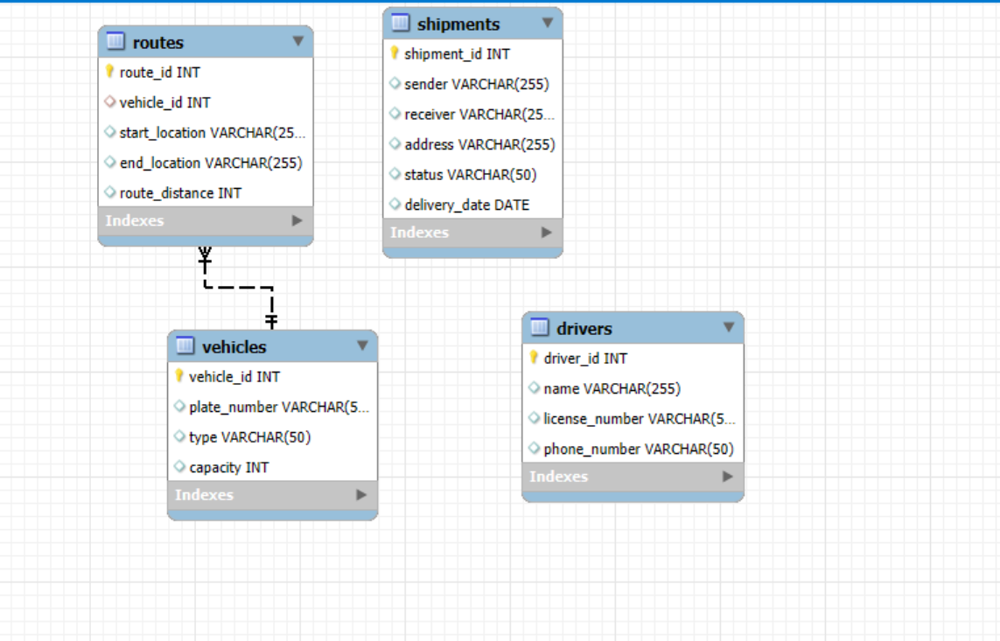

# finalProject_database_plp
# Logistics Management System Database

This SQL script creates a database named `logisticsdb` for a logistics management system. It includes the necessary tables to manage shipments, vehicles, drivers, and routes.

## Overview

The database schema consists of the following tables:

* **shipments:** Stores information about individual shipments, including sender and receiver details, delivery address, current status, and the expected delivery date.
* **vehicles:** Contains details about the vehicles used in the logistics operations, such as their unique ID, license plate number, type, and carrying capacity.
* **drivers:** Holds information about the drivers responsible for the shipments, including their unique ID, name, license number, and contact phone number.
* **routes:** Defines the routes taken by vehicles, linking a vehicle to a specific start and end location, and recording the distance of the route.

## Prerequisites

* **MySQL or a compatible database system:** This script is written in standard SQL and is primarily intended for use with MySQL. You might need to make minor adjustments for other database systems.
* **Database access:** You need the necessary privileges to create databases and tables in your database environment.

## Setup Instructions

1.  **Save the script:** Save the provided SQL code as a `.sql` file (e.g., `logistics_database.sql`).

2.  **Connect to your database server:** Use a MySQL client or tool to connect to your database server.

3.  **Execute the script:** Run the following command (or use your database tool's interface to execute the script):

    ```sql
    SOURCE /path/to/your/logistics_database.sql;
    ```

    Replace `/path/to/your/logistics_database.sql` with the actual path to the saved SQL file.

## Database Structure

### `shipments` Table

| Column Name     | Data Type     | Primary Key | Auto Increment | Description                                      |
| --------------- | ------------- | ----------- | -------------- | ------------------------------------------------ |
| `shipment_id`   | INT           | YES         | YES            | Unique identifier for each shipment               |
| `sender`        | VARCHAR(255)  | NO          | NO             | Name of the sender                               |
| `receiver`      | VARCHAR(255)  | NO          | NO             | Name of the receiver                             |
| `address`       | VARCHAR(255)  | NO          | NO             | Delivery address                                 |
| `status`        | VARCHAR(50)   | NO          | NO             | Current status of the shipment (e.g., "Pending", "In Transit", "Delivered") |
| `delivery_date` | DATE          | NO          | NO             | Expected or actual delivery date                 |

### `vehicles` Table

| Column Name   | Data Type    | Primary Key | Auto Increment | Description                         |
| ------------- | ------------ | ----------- | -------------- | ----------------------------------- |
| `vehicle_id`  | INT          | YES         | YES            | Unique identifier for each vehicle   |
| `plate_number`| VARCHAR(50)  | NO          | NO             | Vehicle license plate number        |
| `type`        | VARCHAR(50)  | NO          | NO             | Type of vehicle (e.g., "Truck", "Van") |
| `capacity`    | INT          | NO          | NO             | Carrying capacity of the vehicle    |

### `drivers` Table

| Column Name      | Data Type     | Primary Key | Auto Increment | Description                      |
| ---------------- | ------------- | ----------- | -------------- | -------------------------------- |
| `driver_id`      | INT           | YES         | YES            | Unique identifier for each driver |
| `name`           | VARCHAR(255)  | NO          | NO             | Name of the driver               |
| `license_number` | VARCHAR(50)   | NO          | NO             | Driver's license number          |
| `phone_number`   | VARCHAR(50)   | NO          | NO             | Driver's phone number            |

### `routes` Table

| Column Name    | Data Type     | Primary Key | Auto Increment | Foreign Key | Description                                  |
| -------------- | ------------- | ----------- | -------------- | ----------- | -------------------------------------------- |
| `route_id`     | INT           | YES         | YES            |             | Unique identifier for each route             |
| `vehicle_id`   | INT           | NO          | NO             | YES         | Foreign key referencing `vehicles.vehicle_id` |
| `start_location`| VARCHAR(255)  | NO          | NO             |             | Starting location of the route               |
| `end_location` | VARCHAR(255)  | NO          | NO             |             | Ending location of the route                 |
| `route_distance`| INT           | NO          | NO             |             | Distance of the route in a unit (e.g., km)   |

## Usage

This database provides a foundational structure for managing logistics operations. You can use this schema to build applications and tools for:

* Tracking shipments and their status.
* Managing vehicle information and capacity.
* Keeping records of drivers and their contact details.
* Defining and managing delivery routes.
* Querying and reporting on logistics data.

## Notes

* The script includes a commented-out line for dropping the database if it already exists (`DROP DATABASE IF EXISTS logisticsdb;`). Uncomment this line with caution, as it will permanently delete the database and all its contents.
* Remember to adjust database connection settings in your application to connect to the `logisticsdb` database.
* This is a basic schema and can be extended with additional tables and columns to accommodate more complex logistics management requirements (e.g., tracking shipment assignments to vehicles/drivers, timestamps for status updates, etc.).


# EDR DIAGRAM
* Attached is an EDR diagram.


